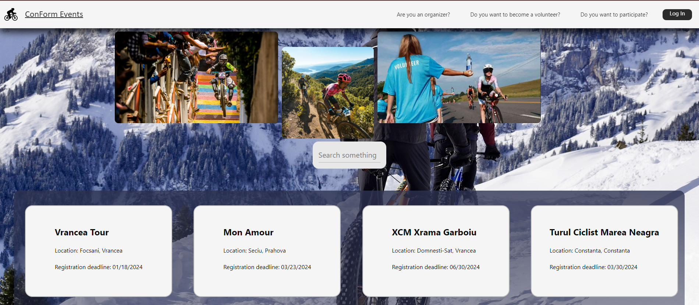
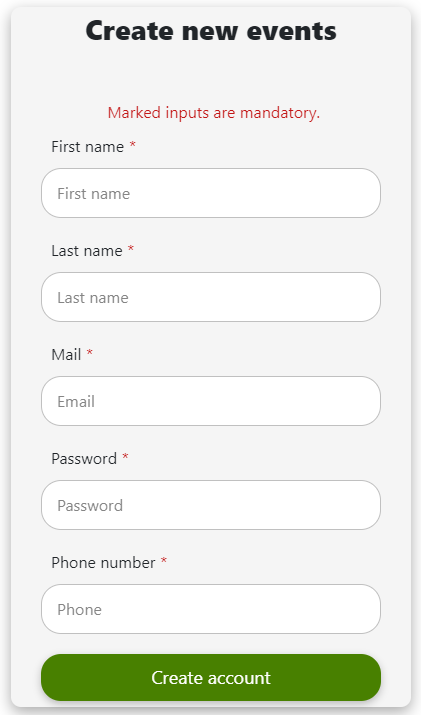
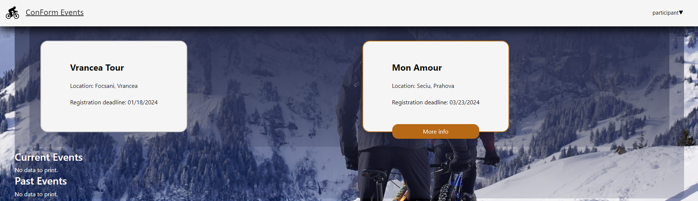
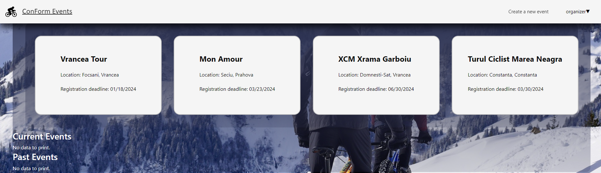
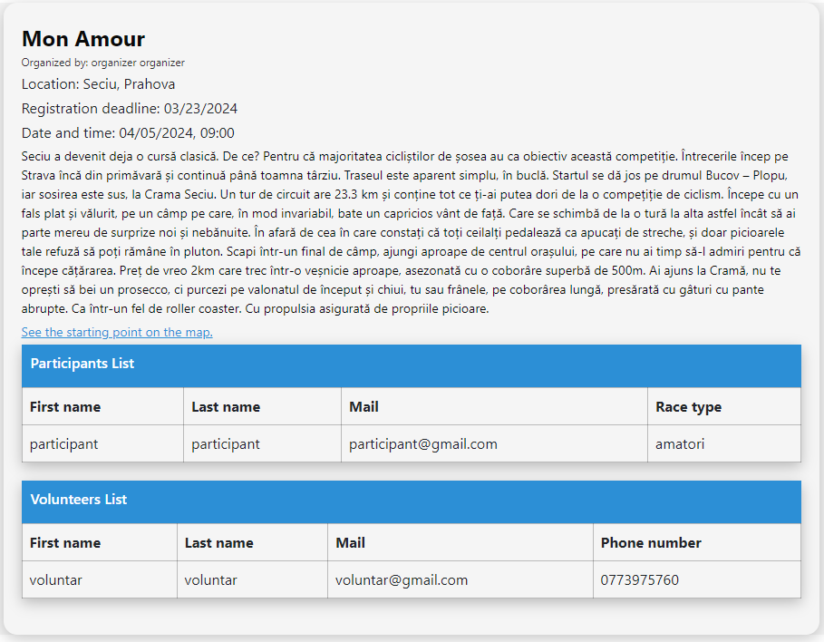

# ConformEvents
## Web technologies project
##### Authors: Claudiu Cercel, Octavian Cilibia, Craciun Carmen
> 1. **Scope of the project**
> > This project aims to satisfy the assigment made between the boundaries of faculty subject: *Web Technologies*, but also aims to teach us how to create ***spring-boot*** and ***react*** apps
> 2. **Technologies used**  
> > For the programming languages we are using:
> > > a. ***Java***
> > > c. **_TypeScript_**  
> > > d. **_ReactJS + CSS_**       
> 
> > Other technologies used:  
> > > a. **_Spring-Boot_**  
> > > b. **_ReactJs_**  
> > > c. **_Docker_** for hosting the database  
> > > d. **_Postman_** for testing the apis without the need of the frontend
> 3. **Images**  
> Main page image: 
> 
> Create account form:
> 
> Review future races in your participant/volunteer account:
> 
> Review created events in your organizer accont:
> 
> Detailed atributes for the event:
> (there is room for improovements)
> 4. Requirements:
> > a. docker(latest version preffered)  
> > b. node modules (version 18 for React)  
> > c. port 3306 free (MANDATORY! If not change the port from application.properties)  
> > d. port 8090 free (for hosting the springboot server)  
> > e. port 5173 free (for hosting the React server)  
> 5. Installation:
> > clone the repo and start docker. Make sure to run docker-compose.yml file. After the creation of the container create the database instance in your ide in order to easily view the tables. Then run ConformEventsApplication.java file. For the React server navigate to the frontend folder and run _`npm run dev`_.  
>  
> > Go to `http://localhost:5173` and enjoy the app
